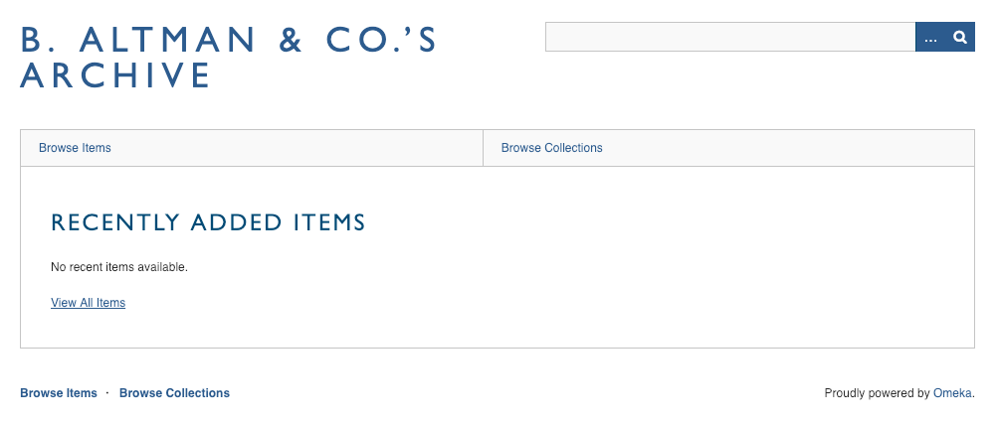
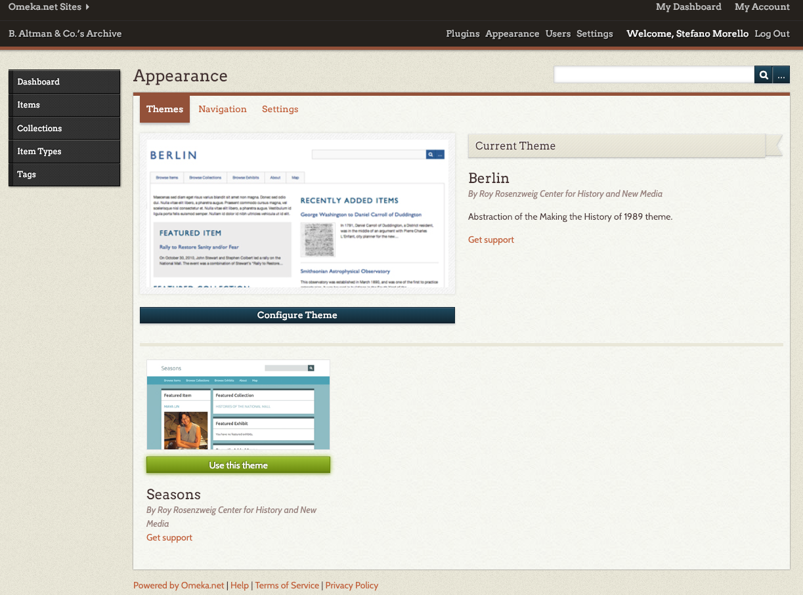
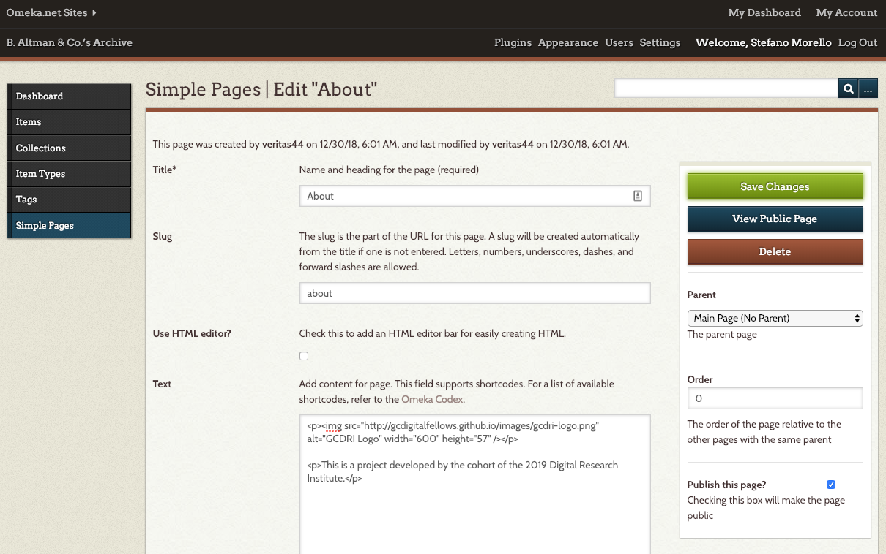
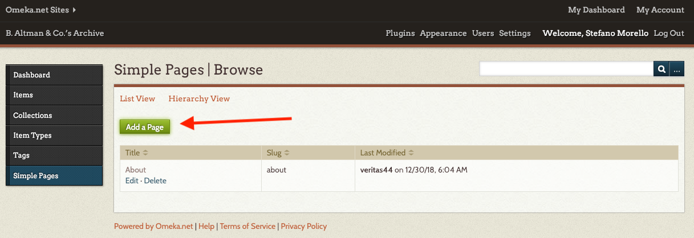
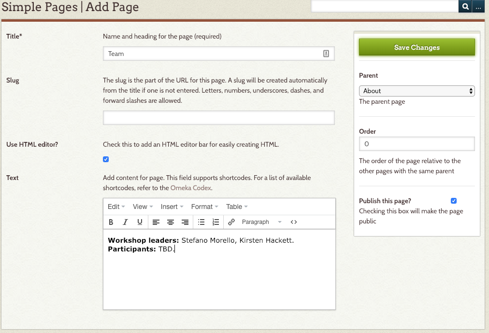

# Themes and Plugins

One of the most powerful aspect of Omeka is that it’s extensible and modular – not unlike, there are themes and plugins available for use. Themes change the look and feel of Omeka, while plugins change what Omeka is capable of doing. 

## Themes 
Themes control the look and feel of your Omeka site: the color, the font, the layout. There are (currently) two themes included with the free basic plan for hosted Omeka sites; these themes can be configured to some extent with custom banner images and different colors and so on. There are more than [a dozen themes](Http://omeka.org/add-ons/themes/) for self-hosted Omeka sites. You can also design your own theme for Omeka, as many of the larger and more advanced Omeka sites, such as Colored Conventions, do. 

From your dashboard, visit your site by clicking on the site title in the top left corner. This is what your website looks like by default. 



Let’s try to change it. Return to your dashboard and click on _Appearance_. Click on _Use This Theme_ to activate the Seasons theme. From this page, under the _Navigation_ and _Setting_ tabs, you’ll also be able to make some minor changes to the look of your website. 



## Plugins 
Like themes, plugins are separate “add-ons” to Omeka, but whereas themes change the look and feel of an Omeka site, plugins change the functionality of an Omeka site — they change what it can do. There are (currently) eight plugins packaged with the free Basic plan on Omeka.net, but there are more than 50 cool plugins for the self-hosted version of Omeka listed at [Omeka.org/plugins](http://omeka.org/plugins) that do everything from enabling anyone on the web to contribute items to your archive (with the [Contribution](http://omeka.org/add-ons/plugins/contribution/) plugin) to tweeting out an announcement whenever a new item is added (with the [Tweetster for Omeka](http://omeka.org/add-ons/plugins/tweetster-for-omeka/) plugin). Some of these plugins are developed by the Omeka team at RRCHNM, but a lot of them are developed by people who are customizing Omeka for their own purposes and contributing their code to the larger community. 

### Sample Pages Plugin
Let’s try and activate the Sample Page plugin. This allows us to create static web pages in our Omeka site. Click on _Plugins_, scroll to the bottom of the page and click on _Install_ to activate the simple pages plugin. 


You’ll notice that a new link appeared on the left hand side. Click on _Simple Pages_ to add or edit your static pages. Upon activating the plugin, it automatically creates an “About” page. Click on _Edit_ to change its content. You can write in Html or use the visual Html editor.

Copy/paste the content below in the text box.

``` 
<p></p>
<p>This is a project developed by the cohort of the 2019 Digital Research Institute.</p>
```

Click on _Save_. 



When you visit your website, you’ll notice that, in addition to the previous sections, you can now find a new link in your menu. 

Let’s now try and add a subpage. Click on Simple Pages, and add a page. 



We are going to call it “Team.” On the right hand side, make sure you select the check box “Public” and the About page as a “parent” page. You can now try and use the HTML editor bar to edit the format and the pagination.



```
Workshop leaders: Stefano Morello, Kirsten Hackett.
Participants: 
```

Click on _Save_.


## One more thing...
There are two more options in the top right menu that we need to explore. One is Settings, from there, you can change your site information (title, description, etc.), and the other one is “users.” You can add as many users as you like to an Omeka site, even when you only have a free Basic plan on omeka.net. You can add users in four roles:
* Super – can do everything
* Admin – can do everything with items and exhibits etc., but can’t access Settings
* Contributor – can add items and create exhibits, but can’t publish them, and can’t modify items added by other Contributors
* Researcher – can only see items, but can see all items, including private items that aren’t published to the web. Note that all items you add to Omeka are private by default; you must deliberately check a checkbox in order to publish an item to the web. This is useful when you want to include an item in your archive but don’t want to publish it to the web, as for instance when the copyright status of an item is unclear. Users who are logged in can see both private and public items (explain difference) in Omeka, so the “Researcher” role allows you to let selected individuals see but not edit your items.

[<<< Back](createasite.md) [Next >>>](addanitem.md) 
